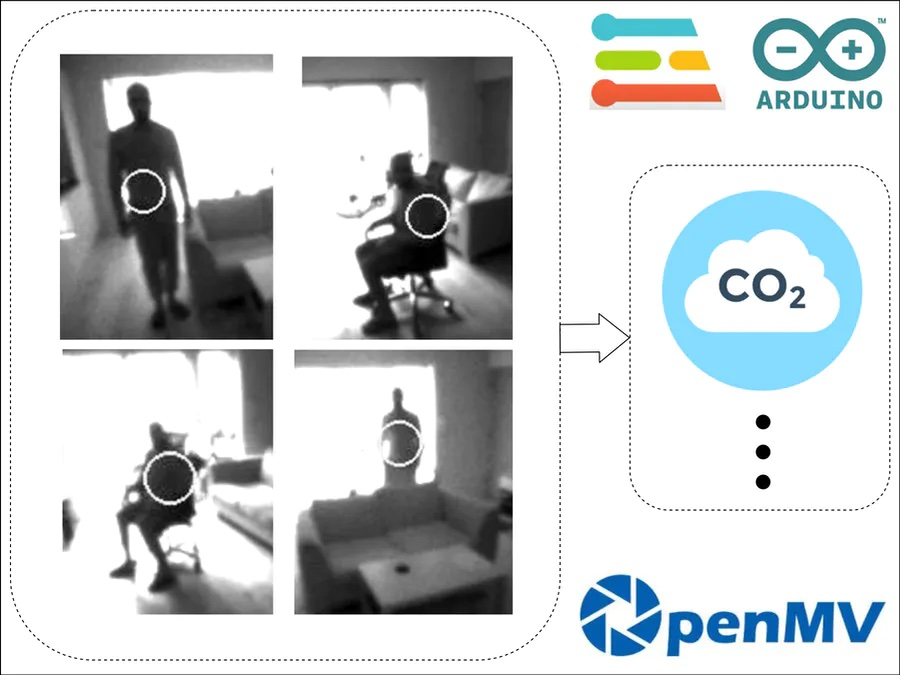
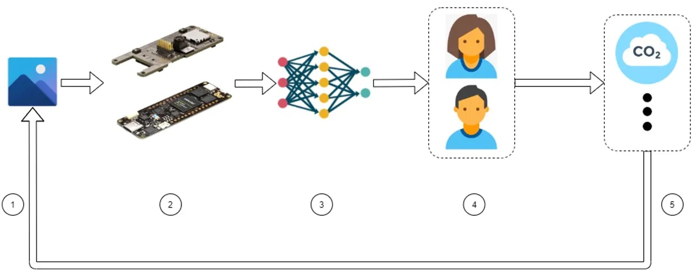

# Indoor CO2 Level Estimation Using TinyML

Created By:
Swapnil Verma 

Public Project Link:
[https://studio.edgeimpulse.com/public/93652/latest](https://studio.edgeimpulse.com/public/93652/latest)



### Problem Overview

It has been almost two and half years since the COVID-19 pandemic started. After multiple vaccines and numerous tests, we are slowly going back to our old life; for me, it's going back to the office, seeing people and organising face to face meetings (along with video calls, of course). Even though we are going back to our old lives, COVID is far from over, and to prevent and monitor infection, we have specific arrangements in place. One such arrangement is CO2 monitors in an indoor environment. One study suggests that we can predict the infection risk by observing a CO2 level in an indoor environment\[1]. A higher level of CO2 means poor ventilation and/or higher occupancy, thus a higher infection risk.

Can we predict a higher infection risk using any other technique? Let us explore our options.

### Solution

My solution uses a TinyML based algorithm to detect and count the people in an indoor environment. The algorithm will be deployed on a microcontroller. The microcontroller will capture an image or stream of images using a camera and then perform inference on the device to count people.

The device can record the occupancy level locally or send it to a remote machine, possibly a server, for further evaluation. After counting the number of people in an indoor environment, we can do all sorts of things. For example, we can calculate the approximate CO2 level in the room, the distance b/w people to predict the infection risk \[2], etc. In this project, I will focus on CO2 level estimation.

### Hardware

The hardware I am proposing for this project is pretty simple. It consists of

* An Arduino Portenta H7
* An Arduino Portenta Vision Shield

This project is powered by a TinyML algorithm prepared using [Edge Impulse](https://www.edgeimpulse.com); therefore, it is not limited to just one type of hardware. We can deploy it on all the [supported devices](https://docs.edgeimpulse.com/docs/development-boards/fully-supported-development-boards) as well as on your smartphone!

### Software

#### **1.** **Dataset**

In this project, the dataset I am using is a subset of the PIROPO database \[3].

> PIROPO Database - https://sites.google.com/site/piropodatabase/

The dataset contains multiple sequences recorded in the two indoor rooms using a perspective camera.


The original PIROPO database contains perspective as well as omnidirectional camera images.

I imported the subset of the PIROPO database to the Edge Impulse via the [data acquisition](https://docs.edgeimpulse.com/docs/edge-impulse-cli/cli-uploader#upload-data-from-the-studio) tab. This tab has a cool feature called [labelling queue](https://www.edgeimpulse.com/blog/3-ways-to-do-ai-assisted-labeling-for-object-detection), which uses YOLO to label an object in the image automatically for you.


I used this feature to label _people_ in the PIROPO images. I then divided the data into _training_ and _test_ sets using the _train/test split_ feature. While training, the Edge Impulse automatically divides the training dataset into _training_ and _validation_ datasets.

#### **2. Training and Testing**

Training and testing are done using above mentioned PIROPO dataset. I used the [FOMO](https://www.edgeimpulse.com/blog/announcing-fomo-faster-objects-more-objects) architecture by the Edge Impulse to train this model. To prepare a model using FOMO, please follow this [link](https://docs.edgeimpulse.com/docs/tutorials/counting-objects-using-fomo).


The training F1 score of my model is 91.6%, and the testing accuracy is 86.42%. For live testing, I deployed the model by building openMV firmware and flashed that firmware using the OpenMV IDE. A video of live testing performed on Arduino Portenta H7 is attached in the Demo section below.

#### **3. How to run the software?**

This section contains a step-by-step guide to downloading and running the software on the Arduino Portenta H7.

* Clone or download [this](https://github.com/sw4p/Person\_Detector) repository.
* Follow [this](https://docs.edgeimpulse.com/docs/tutorials/running-your-impulse-locally/running-your-impulse-openmv) edge impulse guide to flash the firmware (edge\_impulse\_firmware\_arduino\_portenta.bin) on the Arduino Portenta H7 using the OpenMV IDE.
* Open the ei\_object\_detection.py and run it in the OpenMV IDE.

### How does it work?



This system is quite simple. The Vision shield (or any camera) captures a 240x240 image of the environment and passes it to the FOMO model prepared using Edge Impulse. This model then identifies the people in the image and passes the number of people to the CO2 level estimation function every minute. The function then estimates the amount of CO2 using the below formula.

```
CO2_level = CO2_level + (0.02556 * people_count)
```

The average human exhales about 2.3 pounds of carbon dioxide on an average day \[4], and the magic number 0.02556 comes by dividing 2.3 by 24x60 (minutes in a day) and converting it into ounces. The equation calculates the amount of CO2 in ounces per minute. The person detection model can be used with any other application for example occupancy detection etc. The system then repeats this process again.

### Demos

The testing accuracy of this model is 86.4% when tested with the PIROPO dataset. But that is not the final test of this model. It should perform well when introduced to a new environment, and that is exactly what I did. I used this model on the Arduino Portenta H7 with the vision shield to detect myself in my living room. The model has never seen me nor my living room before. Let's see how well it performs.

The calculation of CO2 level is a straightforward task compared to person detection, therefore, in these demos, I have focused only on person detection.

**Note:** These videos are 240x240 in resolution and are recorded using the OpenMV IDE. The FPS (Frame Per Second) improves when the device is not connected to the OpenMV IDE.


Single Person Walking


In the above video, the model is doing quite well. It is missing me in some frames but it has got a lock on me most of the time. I was surprised to see it work this well even when I was behind the couch.


Single Person Coming From Far


In the above test, I am testing how well it detects someone standing far from the camera. To my surprise, it is detecting me well even when I am standing farthest I could be in this room. It is also detecting me when I am a little sideways while walking.


Person Sitting on a Chair


In the above test, I wanted to see the system's performance when I am sitting on a chair. It works excellent when it sees me from my side but it is not detecting me when I am facing the camera. I think it is because, in my training data, all samples where a person is sitting on a chair capture their side profile and not the front profile. It can be improved by using datasets which contain a person sitting on a chair and facing toward the camera.

### Conclusion

Looking at the live testing performance of this model, it is clear that the model is working quite well but has some room for improvement. Considering that the inference is performed on a Microcontroller with 240x240 image data, I am happy with the results. As a next step, I will try to improve its capability as well as accuracy by using diverse training data.

The CO2 level estimation is a simple task given the person detection model has good accuracy and repeatability. The next step for this application would be to improve the estimation by also considering the flow of CO2 out of an indoor space.

### Reference

* \[1] [https://journals.sagepub.com/doi/10.1177/1420326X211043564](https://journals.sagepub.com/doi/10.1177/1420326X211043564)
* \[2] [https://www.sciencedirect.com/science/article/pii/S221067072100069X](https://www.sciencedirect.com/science/article/pii/S221067072100069X)
* \[3] PIROPO Database - [https://sites.google.com/site/piropodatabase/](https://sites.google.com/site/piropodatabase/)
* \[4] [https://www.nrdc.org/stories/do-we-exhale-carbon#:\~:text=So%20breathe%20easy.,CO2%20as%20his%20sedentary%20brethren.)](https://www.nrdc.org/stories/do-we-exhale-carbon#:\~:text=So%20breathe%20easy.,CO2%20as%20his%20sedentary%20brethren.\))
