# Oil Tank Measurement and Delivery Improvement Using Computer Vision 

Created By:
Mithun Das 

Public Project Link:
[https://studio.edgeimpulse.com/public/105298/latest](https://studio.edgeimpulse.com/public/105298/latest)

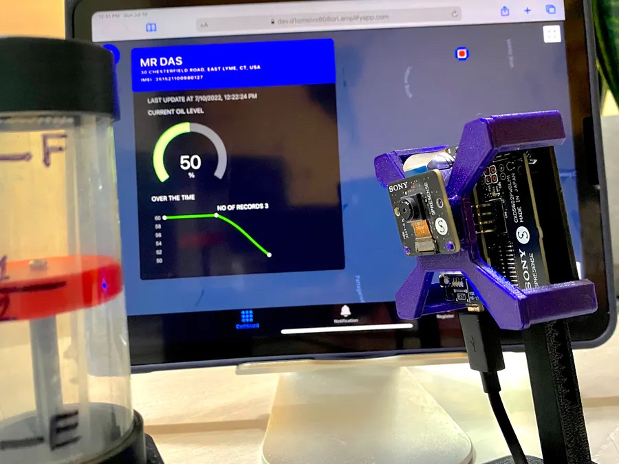

## Heating Oil And Usage

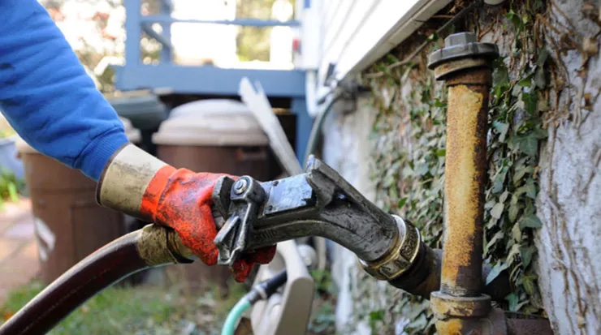

Heating oil is mainly used for space heating. Some homes and residential commercial buildings also use heating oil to heat water but in much smaller amounts than what they use for space heating. Because cold weather affects heating demand, most heating oil use occurs during the heating season—October through March.

In the winter of 2020–2021, about 5.3 million households in the United States used heating oil (distillate fuel oil) as their main space heating fuel, and about 82% of those households were in the U.S. Northeast. 

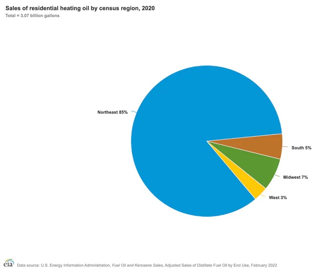

Heating oil is also used in many countries in Europe. [Source](https://www.upei.org/images/UPEI_Heating_Oil_Fiche_FIN.pdf)

## Operational Inefficiencies

Usually heating oil companies deliver the oil in a truck. Many heating oil companies monitor your usage to determine when you will need oil delivery again. These calculations are performed using degree days and a K-factor. The degree days calculation adds the high and low temperatures on a given day, divides it by two, and subtracts 65 from the quotient. This number is added to your home’s K-factor.

The K-factor determines “degree days per gallon” (think something similar to “miles per gallon” here) to estimate how quickly you use heating oil. Over time, our heating oil company can settle on a relatively stable K-factor for your home. We can then calculate your next delivery using your unique K-factor and our own calculations.

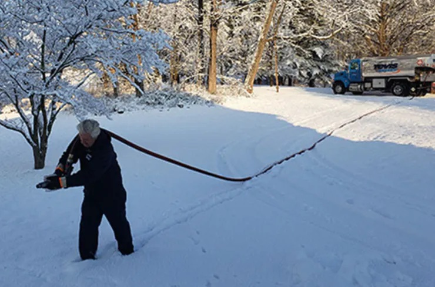

But this calculation is not accurate all the time. Family can go on vacation resulting in less oil consumption or some relatives visiting during holiday season resulting in more oil consumption.

Okay, so what's the big deal?

**Extra cost and additional CO2 emission** - If the delivery is done when tank is 3/4 full, it's a waste of money and extra emission of CO2 in the environment. Delivery during cold weather is expensive in terms of effort as well. It does not make sense to fill the tank when it's already 3/4 full.

**No heat during cold** - On the other hand, if consumption is high suddenly and tank empty, there would not be any oil to heat the house. This can be very challenging and life threatening as well.

With **real time reading of oil tank**, delivery company can schedule the delivery precisely when it's needed. This will eliminate unwanted visit to the resident reducing delivery cost and less CO2 emission.

## How AI On The Edge Can Help?

Most of the oil tanks have analog meters which are not easy to read by machines. Moreover adding a sensor in the existing tank to measure fuel level is expensive as it needs some poking with oil tanks which are typically old and there is a risk to damage the tank.

I am looking for a **cost effective and non-invasive** way to read the analog meter in real time.

Using visual regression, we can train a model to read analog meter and predict a scalar value between 0 to 100. This value is then sent to cloud using cellular connection.

## Edge Impulse And Visual Regression

### Data Capture

With any ML project, data capture is the most important step. To capture data from our heating oil tank is time consuming as meter moves very slow and I may need to wait for a month to capture all different readings. So I designed a 3D printed analog meter similar to real heating oil tank meter to capture data.

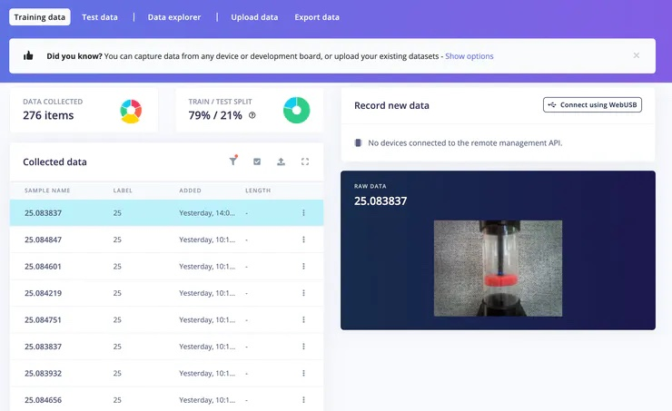

Precise prediction isn't necessary for this use-case, I mean it's not a big deal if prediction is 5-10% off. So I choose following readings:  0%, 13%, 25%, 37%, 50%, 65%, 87% and 100%. 

Ideally we must refill our tank when it's around a quarter full, meaning around 25-30%.

Sony Spresense if supported by Edge Impulse out of the box which means they have firmware to help you connect the board to EI Studio and capture images. Please checkout this [blog](https://docs.edgeimpulse.com/docs/development-platforms/officially-supported-mcu-targets/sony-spresense) which explains how.

### Creating Impulse

Creating impulse in Edge Impulse is basically creating your ML model.

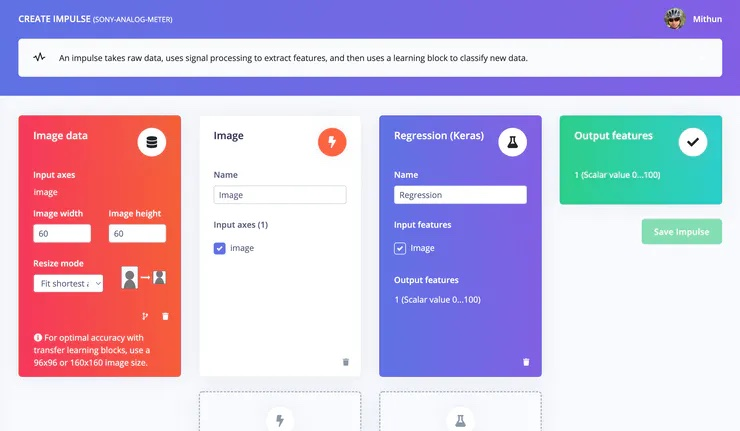

I have collected 96x96 images but trained the model with 60x60 grayscale. This makes the model size small but compromises the accuracy a bit. You should experiment different option and see what fits best for you.

Once you finish training, you may see lot of incorrect regression but if you take a closer look (above image) , you will realize those are entirely not incorrect. 25 was predicted as 25.12 which we can happily accept for our use-case.

You may take a look at the EI project [here](https://studio.edgeimpulse.com/public/105298/latest).

### Deploy

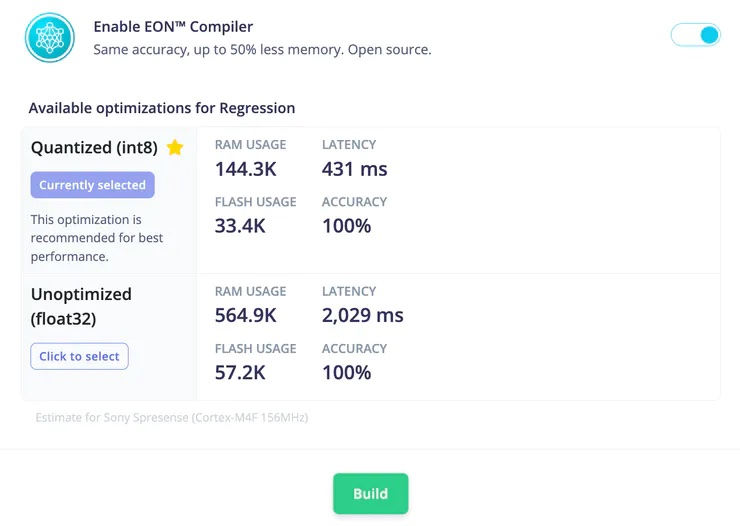

I have decided to download the model as quantized Arduino library considering Flash memory & RAM usage. Then used that in my Arduino sketch.

`#include <sony-analog-meter_inferencing.h>`

## Connect To AWS IoT

Once I get the model prediction, I connect to cellular network and send data to AWS IoT core over MQTT. Before you can connect to AWS IoT core, you need to

 - Create a policy
 - Create and download certificates ( Root CA, certificate and private key )
 - Attach certificates to the created policy
 - Create a Thing
 - Attached policy to the Thing

It can be overwhelming. So I create a python script which will do all these for you. Locate the `register.py` program, change the variables and run the program. This will create the aws resources for you and download the certificates and private key under certs folder. Now you need to copy those files to the SD card and insert into LTE board.

## System Architecture

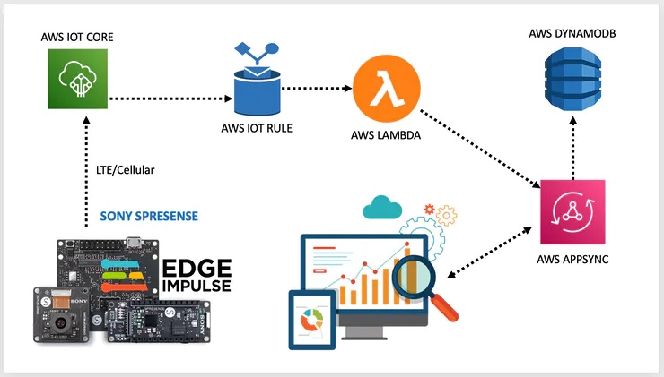

Once data is sent to AWS IoT topic, the defined IoT Rule invoke the lambda function passing the value.

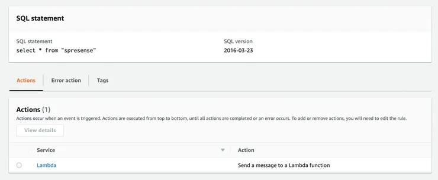

The lambda function read the raw value coming from the topic, map that to 1/4, 1/2,3/4 and full and persist the data to a dynamoDB table through GraphQL mutation.

Mapping of raw data is to flatten the prediction error. Like in below image, raw value came from Sony Spresense varied between 47 and 51. But in reality meter did not change. Rounding off those would give us reading of 50. Reading on dashboard will change when there is a significant change in the reading, such as 10% decrease.

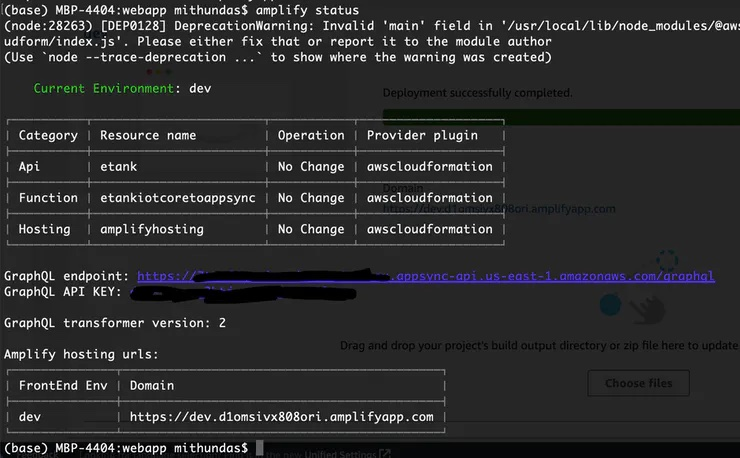

I am using AWS Amplify to create the GraphQL API and Lambda function. I am also using Amplify to host the web app. If you have not worked with [AWS Amplify](https://docs.amplify.aws/start/), I would highly encourage you to check that out.

## Dashboard UI

Before we install and start consuming data from the smart device, we need to register the device on the app.

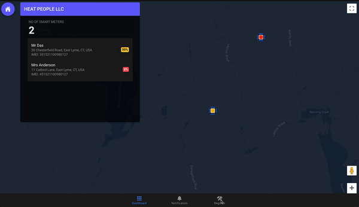

Once smart meter is installed and powered on, app start showing data on the dashboard.

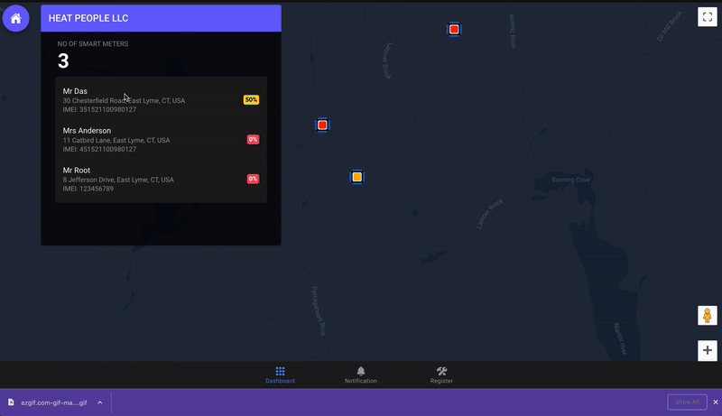

## Demo



## Low-Powered Battery Operated

Another key aspect of this project is to run the smart meter on battery for several months before recharging. This is important as there may not be a power source near the heating oil tank.

Things considered to maximize the use of battery are:

 - Sony Spresense supports 156, 32 or 8 MHz clock frequency. I set clock mode to 32 MHz as Camera can work on it. And power consumption is almost half compare to 156 MHz.
 - Stored AWS certificates in a header file rather on the SD card. Typically it draws around 40mA for read/write operation which is quite high compare to GNSS read (7mA).
 - Not reading GNSS to obtain GPS location of the smart meter as its location is static. Not going to change once installed. Smart meter location is inserted from the app during device registration. This helps save battery further.
 - Reading data once every day. As oil lever is not going to decrease significantly every hour, it's over killing to read the meter very frequently like every minutes or hours. Smart meter wakes up every 24 hours, take picture, run the inference to predict the reading, connect to cellular network and send data to AWS IoT core over MQTT. The whole process takes around 150 seconds. Rest of the time the device goes to deep sleep mode drawing about about 300 μA.
 
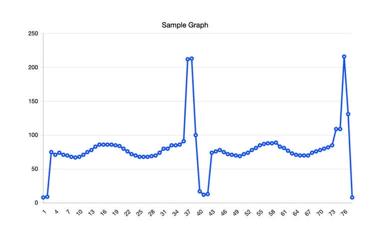
 
Based on my brief research, with clock 32MHz, average current draw was around 75mA with a spike to 213 mA when board connects to cellular network and send data to AWS. And total execution time was around 76 seconds.

With clock 156 MHz, average current draw was around 110 mA with one big spike to 264 mA and few spikes to between 150-200. We may consider average of 115 mA. Total execution time was 64 seconds compared to 76 seconds.

Hourly consumption is calculated as:

`Cawake × (Tawake / 3600) + Csleep × ((3600-Tawake) / 3600)`

Assuming current draw is 75 mA (32 MHz clock) , with 2500mAh battery, it will last about **55** days and with 115 mA (156 MHz clock), it will last about **44** days.

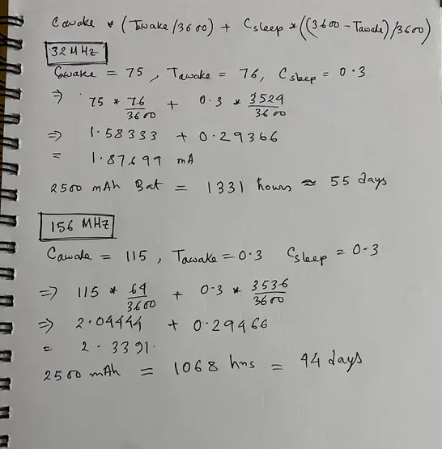

But note, this is an estimate and actual battery life depends on lot of environmental factors such as temperature, qualify of the battery pack, how fast it discharges, etc.



Read [this article](https://developer.sony.com/develop/spresense/tutorials-sample-projects/spresense-tutorials/how-to-make-spresense-super-power-efficient#tutorial-step-1) for more information.

## Challenges

Of course no project is without challenges. I am not going to discuss any technical challenges I faced to get the Sony Spresense working with LTE over secured connection or setting up the truphone sim card as I believe it's very generic and common with any new dev board we try for the first time. Other challenges to point out are:

 - Different background of the image has huge impact on the performance of the regression model. So I decided to have a static background. This is a feasible option in production as well.
 - Lighting is another aspect. Heating oil tanks are mostly located in the basement without any natural light. We should have LED light before taking the picture.
 
## Leak & Anomaly Detection

As I am receiving readings from the board, we can run ML model on AWS to predict any abnormality such as too fast draining of oil which may indicate some leakage or provide some feedback to the customer to review the usage.

## Code

Code for this project is located here:  [https://github.com/just4give/sony-analog-meter](https://github.com/just4give/sony-analog-meter)
