# Recyclable Materials Sorter with NVIDIA Jetson Nano 2GB

Created By:
Zalmotek 

Public Project Link:
[Coming Soon]()

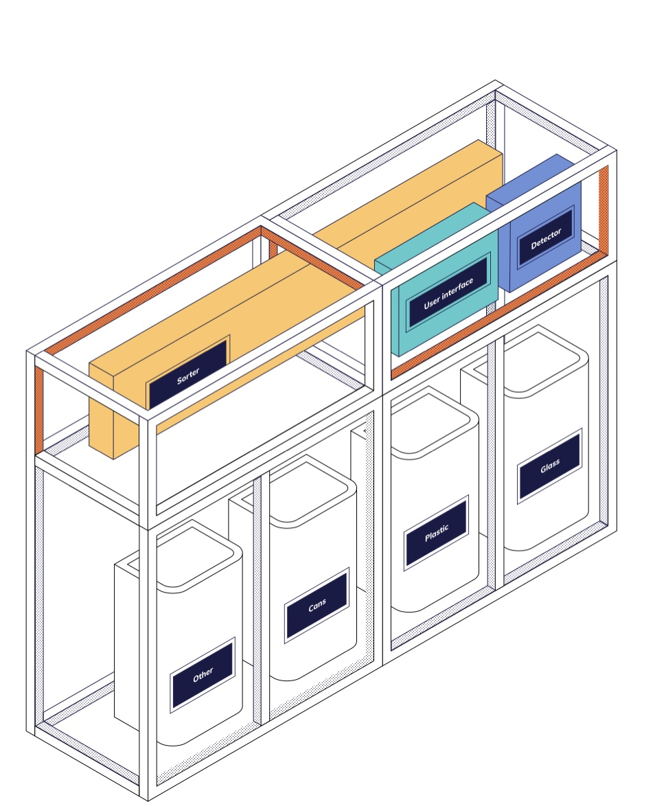

## Introduction

A reverse vending machine (RVM) is a machine that allows a person to insert a used or empty glass bottle, plastic bottle or aluminum can in exchange for a reward. You might have seen them around large stores, gas stations, restaurants, and malls. These devices are the first line of the long journey of reusable plastic: getting the empty bottle containers back from the people once they are used.

Some device models accept only one type of recyclable container like aluminum cans or bottles, others accept all types and sort them accordingly inside the machine in special larger containers.

We at Zalmotek have built a prototype for such a machine that is able to automatically process and sort glass bottles, PETs, and aluminum cans.

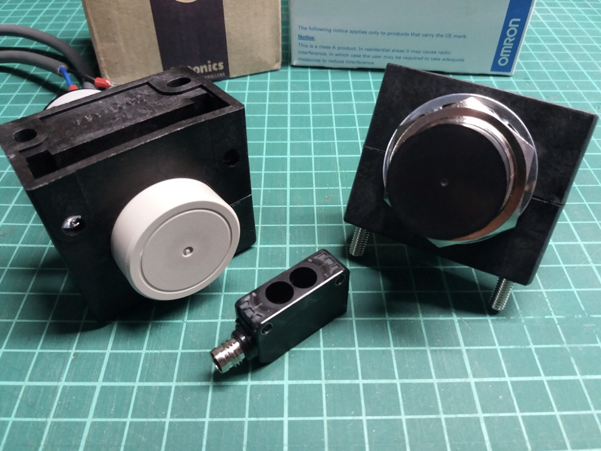

You might not know this, but there is no sensor for plastic or glass. While some **capacitive sensors** can accurately differentiate metals and glass from plastic, for the rest you have to combine other indirect sensor capabilities to narrow the decision in establishing what type of item is in the detector area. For example, **reflective light sensors** shine through glass and some plastic bottles, but not through metal. And **inductive sensors** are great for detecting aluminum cans, but not plastic and glass. We ended up using a combination of 5 sensors on our prototype (1 x inductive, 1 x reflective, and 2 x capacitive sensors calibrated at different thresholds) and our success rate is somewhere at 70%. Not bad for a prototype, but the main problem is that it will forever stay like this unless we employ Machine Learning and Computer Vision to improve the success rate.

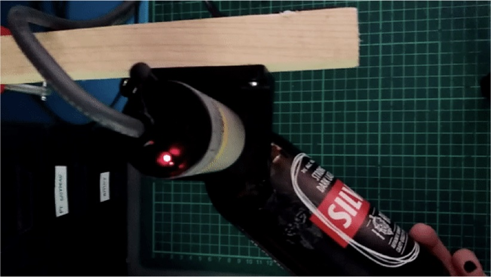

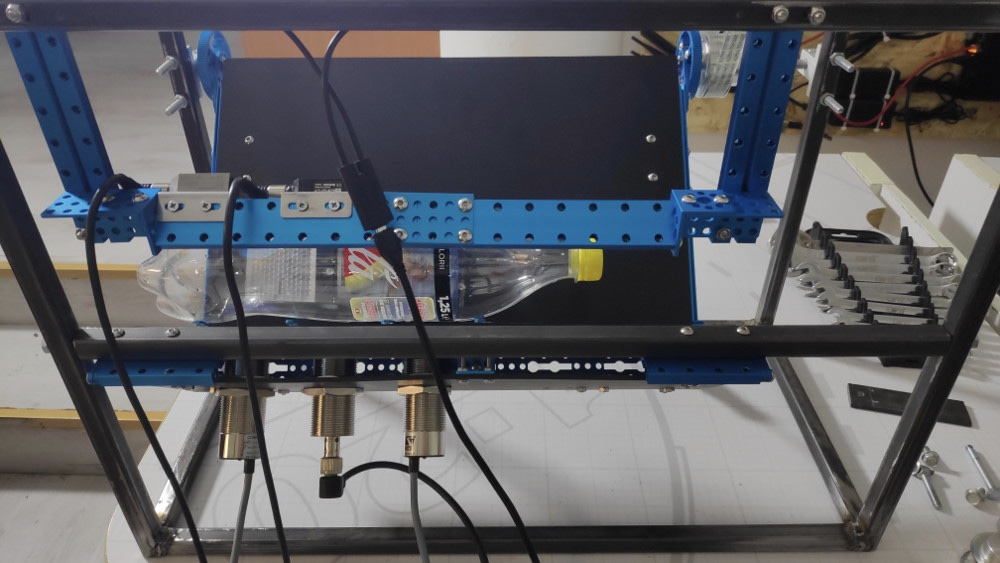

## The Solution

We are aiming to improve the rate of detection of liquid containers by using Edge Impulse to create an added layer of artificial intelligence to the existing sensor network with Computer Vision that will also work as a log of what the machine detects which we can review afterward, having the data from the sensors combined with a picture of the object.

The items are transported from the user through conveyor belts, on which they are sorted, so it’s important to take the pictures on the same surface and use the same illumination conditions. This will be a very important factor to ensure good detection rates. We are using conveyor belts used in the food industry because they are easy to maintain and sanitize.

### Hardware requirements
 - Jetson Nano 2GB Developer Kit
 - microSD card (64GB UHS-1 recommended)
 - Display
 - USB keyboard and mouse
 - Raspberry Pi Camera Module V2 (or another external CSI or USB camera)
 - CSI/USB cable
 
### Software requirements
 - Edge Impulse account

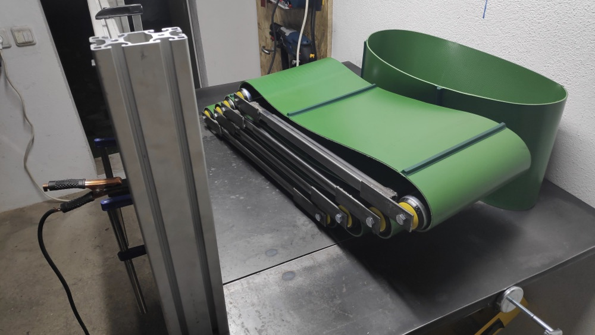


## Hardware Setup

### Setting up the NVIDIA Jetson

NVIDIA Jetson Nano 2GB DevKit has a quick get-started guide [here](https://developer.nvidia.com/embedded/learn/get-started-jetson-nano-2gb-devkit) that, based on your operating system, will help you write the OS on an SD card and start the system. We also recommend having an enclosure for the Jetson to protect it from all sorts of nefarious events. In this tutorial, we have found the [reComputer](https://www.seeedstudio.com/re-computer-case-p-4465.html) case to be a good fit.

After the experimental tests the Jetson will be placed inside the reverse vending machine itself in a designated enclosure and will also serve as a user interface driver using a small HDMI screen.

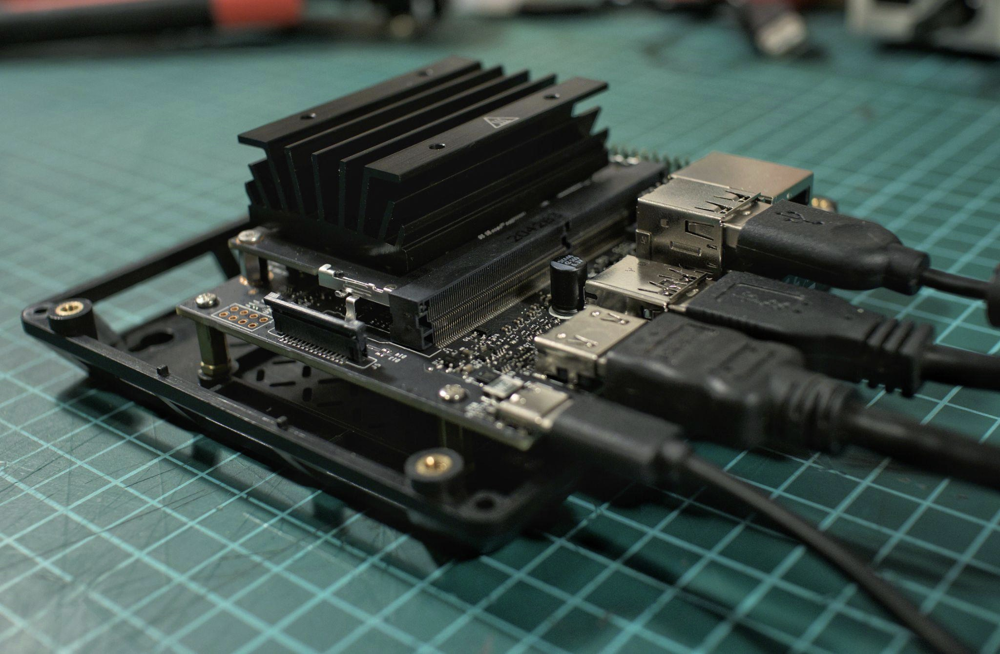


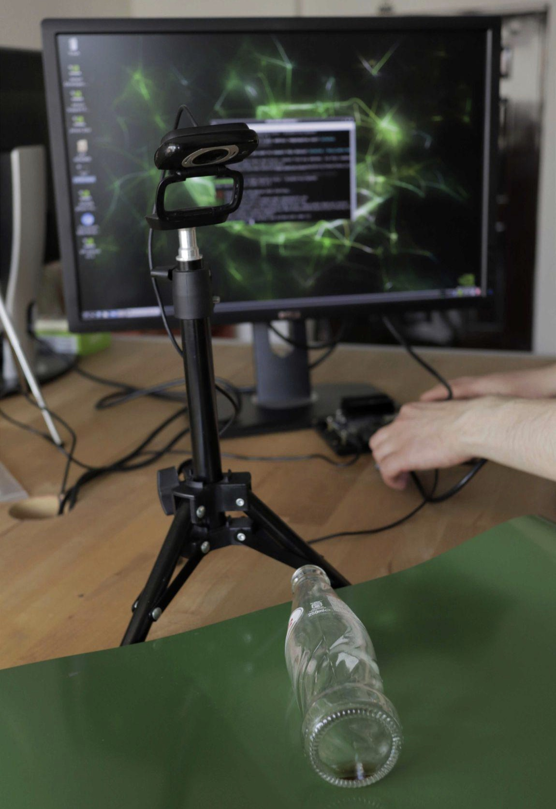

## Software Setup

### Installing the dependencies to run Edge Impulse

Register for a free account on the Edge Impulse platform [here](https://studio.edgeimpulse.com/login), then power up the Jetson and connect the display, keyboard and mouse to run the following commands to install the Linux runner. Start a terminal and run the setup script: 

```
wget -q -O - https://cdn.edgeimpulse.com/firmware/linux/jetson.sh | bash
```

For more in-depth details about the Jetson setup, you can check [this link](https://docs.edgeimpulse.com/docs/nvidia-jetson-nano), although the above command is enough for going to the next step.

## Building the TinyML Model

### Creating an Edge Impulse Project

First step towards building your TinyML Model is creating a new Edge Impulse Project. Choose **Images** as the type of data you will use, then choose **Image Classification**, as we will only have to detect one plastic, aluminum or glass recipient in an image.

### Connecting the device

To connect the Jetson Nano to the Edge Impulse project, run the following command in the terminal:

```
edge-impulse-linux --disable-microphone
```

If you have previously used your device in the past for other Edge Impulse projects, run the following command to reassign the device to a new project:

```
edge-impulse-linux --disable-microphone --clean
```

If you have only one active project, the device will be automatically assigned to it. If you have multiple Edge Impulse projects, select in the terminal the desired one.

Give a recognizable name to your board and press enter.

Your board is now connected to the Edge Impulse project and you can see it in the connected devices panel.

### Collecting and preparing the dataset

There are multiple ways to go about gathering your dataset:

1. Manually taking a bunch of photos, aka data points, using an application like “Cheese!” that comes preinstalled on the NVIDIA Jetson.
2. Recording a video and extracting the frames every 1 second, using a Python script.
3. Take photos using the Data Acquisition panel in Edge Impulse Studio.

For the sake of this tutorial, we have decided to go with the third option, as we find the Data Acquisition panel fit for such a use case that requires a rather small number of photos.


Go to **Data Acquisition** on Edge Impulse Studio and make sure the NVIDIA Jetson is connected to Edge Impulse be running the command that we mentioned previously:

```
edge-impulse-linux --disable-microphone
```

In the **Record New Data** menu, specify the label and click **Start sampling** to take a picture. Make sure you capture all the possible positions and rotations of the recipient, to ensure the model will perform well in non-ideal scenarios. Once you’re done with a category, adjust the label and start sampling again. We’ve used 4 types of recipients for each category (aluminum, plastic and glass), but you can use more if you want to build a more complex model.

You should also perform a  train/test split to balance the data.

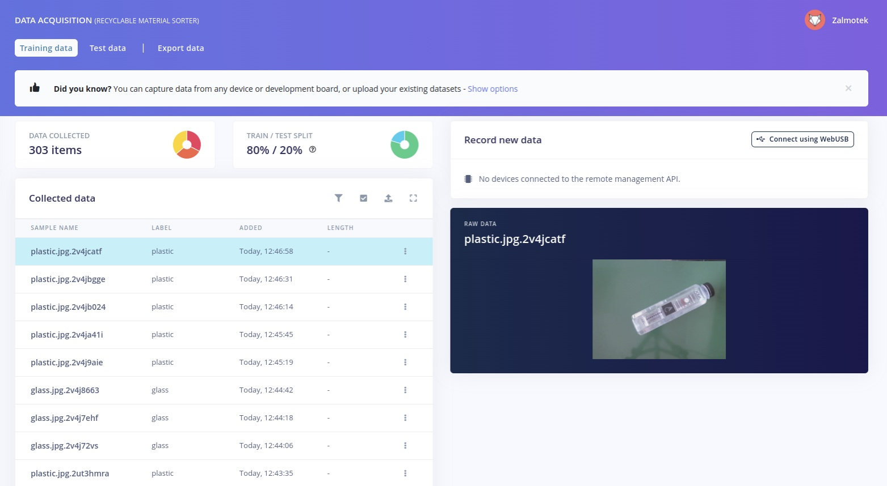

### Creating the impulse

Now we can create the impulse. Go to **Impulse Design** and set the image size to 160x160px, add an **Image** processing block, and a **Transfer Learning** block. We won’t train a model built from scratch, but rather make use of the capabilities of a pre-trained model and retrain its final layers on our dataset, saving a lot of precious time and resources. The only constraint of using this method is that we have to resize the images from our dataset to the size of the images the model was initially trained on (so either 96x96 or 160x160).
The output features will be our categories, meaning the labels we’ve previously defined (aluminum, plastic and glass).

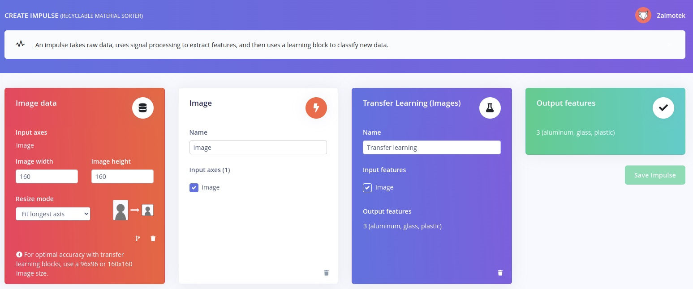

### Generating features

Now go to **Image** in the **Impulse Design** menu and click **Save Parameters** and **Generate Features**. This will resize all the images to 160x160px and optionally change the color depth to either *RGB* or *Grayscale*. We chose the default mode, *RGB*, as the color is an important feature for the recyclable recipients we want to detect. You’ll also be able to visualize the generated features in the **Feature explorer**, clustered based on similarity. A good rule of thumb is that clusters that are well separated in the feature explorer will be easier to learn for the machine learning model.

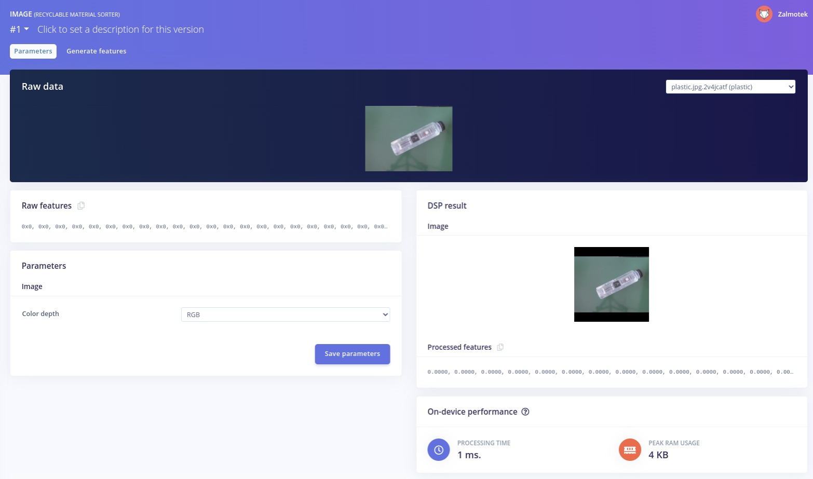


### Training the model

Now that we have the features we can start training the neural network. Leave the default settings and choose the **MobileNetV2 96x96 0.35** model, which is a pretty light model. Since we’re running on an NVIDIA Jetson, we can also run more powerful models from all of all the listed ones, but if you’re running on a dev board with less resources you can use a lighter model.


### Validating the model

Time to test our trained model! Go to **Model testing** and click on **Classify all**. You’ll see in the **Model testing results** tab how the model performed on our testing data. We obtained an accuracy of 98.7% which is pretty good! You can also take a look at the Confusion matrix to identify weak spots of the model and what labels are more likely to be misclassified. Based on this, you can add more items in the training dataset for these classes.


### Deploying the model on the edge

To run the inference on the target, use the following command:

```
edge-impulse-linux-runner --clean
```

and select the project containing the model you wish to deploy.

Once the model downloads, access the URL provided in your serial monitor to watch the video feed, in a browser.

We’ve tested it using the recipients we’ve trained it on and it works well.

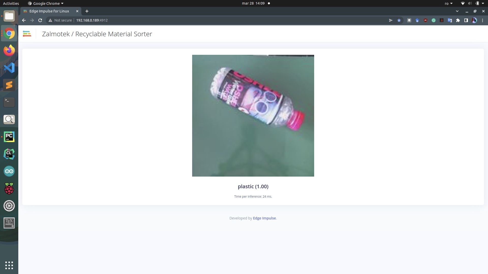

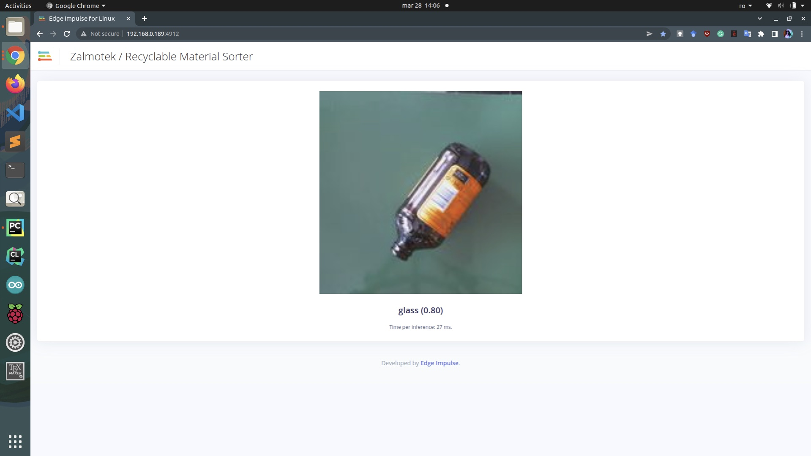


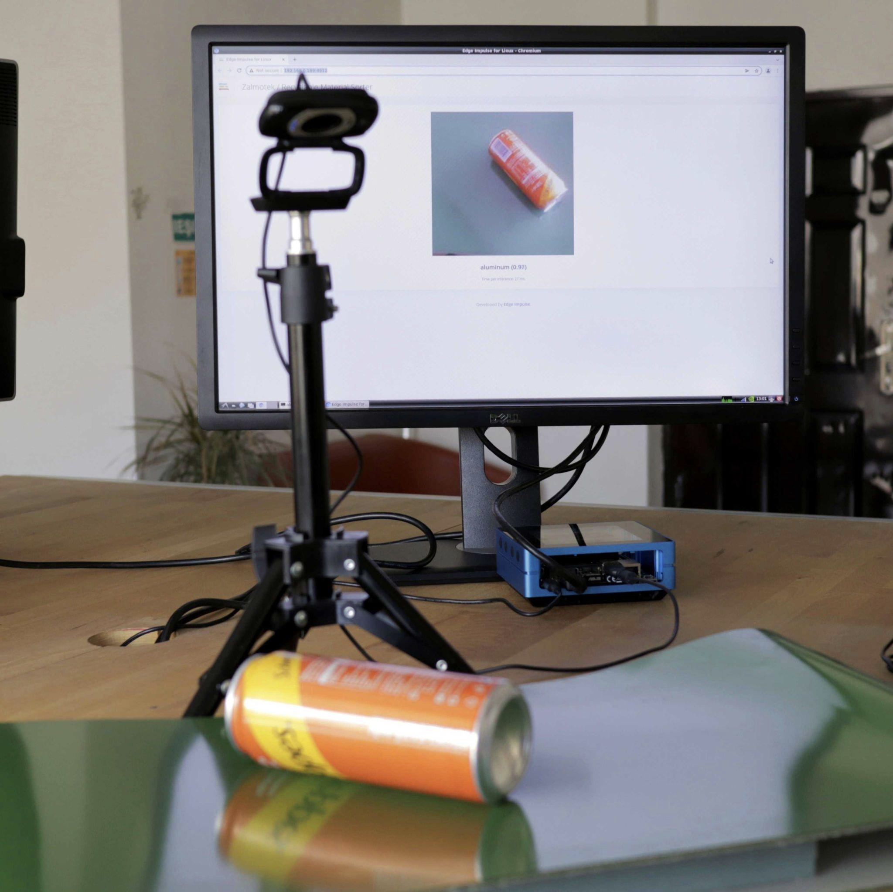

Now the existing software stack running on the Reverse vending machine includes many other components needed to control conveyor belts, monitor sensors, allow user interaction via the screen interface and send alerts based on the filling level of bins. Integrating this added Computer Vision layer will probably be done via the [Edge Impulse Python SDK](https://github.com/edgeimpulse/linux-sdk-python). This might differ in your actual real-world use case. 

Keep in mind that the more samples are labeled correctly and photographed from multiple angles, the better the results will be in the future so it’s useful to keep all the detected objects for further reference so you can improve the model.

## Conclusion

Not all recycling is created equal. Selective recycling, also known as "source separation" has several advantages over traditional recycling methods: 

- it helps to ensure that recyclable materials are actually recycled instead of being sent to landfill. 
- it reduces the need for sorting and cleaning at recycling facilities, which can save time and money. 
- selective recycling can help to increase the overall quality of recycled materials. 

For these reasons, selective recycling is a useful way to reduce waste and promote sustainability and automating it is the only efficient way to go about it.

If you need assistance in deploying your own solutions or more information about the tutorial above please [reach out to us](https://edgeimpulse.com/contact).

